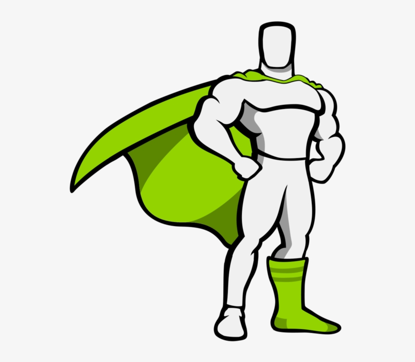

# webDesignPractice
Practicing design skills for web development

## Tools

## WHAT
This is a gallery that lets you click through portraits. This site uses soft ui and animation transitions.

## WHY
- Wanted to build a UI based on [Neomorphism (Soft UI)](https://uxplanet.org/neumorphism-in-user-interface-tutorial-c353698ac5c0) design trend
- Wanted to get more practice with [SASS](https://sass-lang.com/) 
- Wanted to learn more about [GSAP](https://greensock.com/gsap/) 